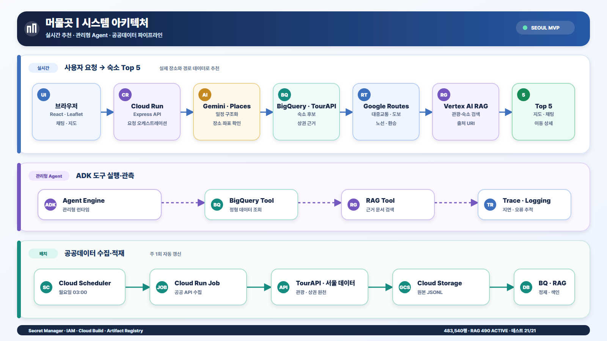
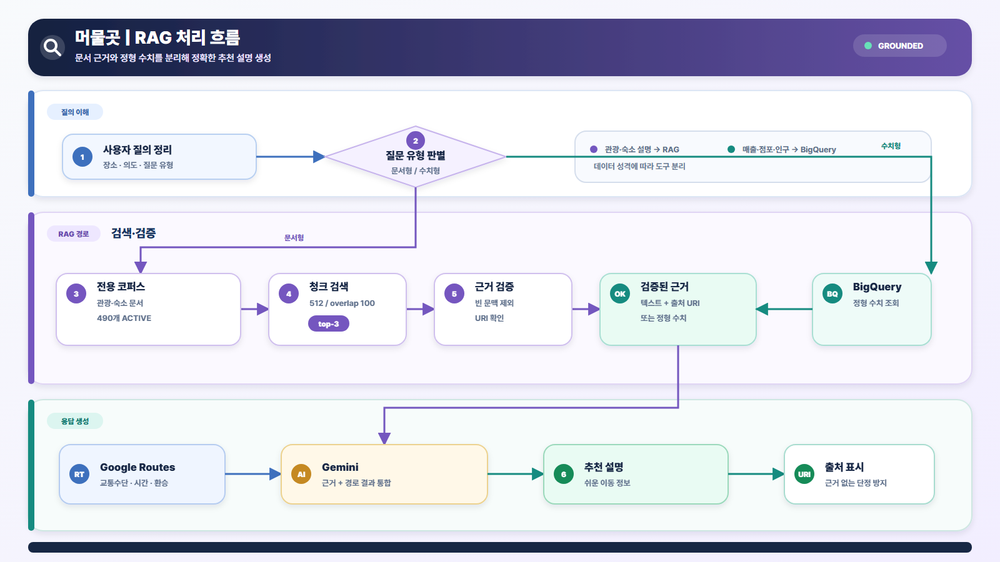
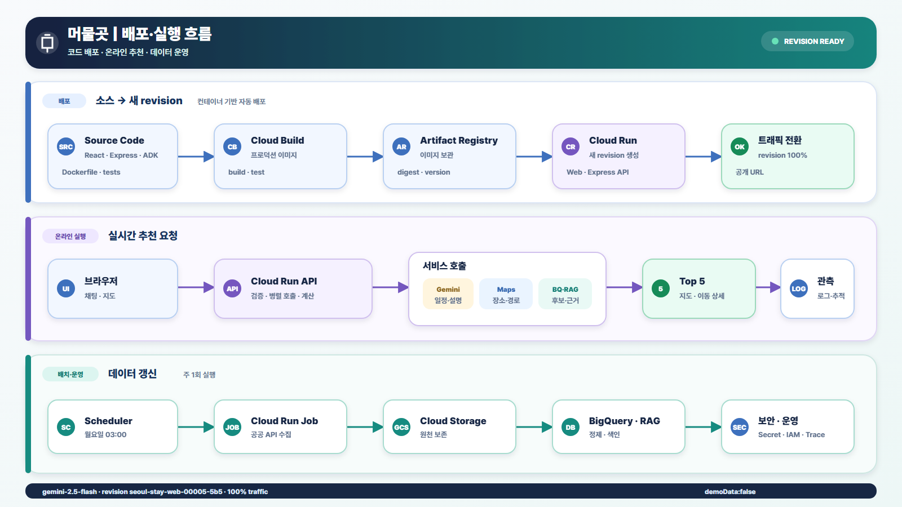

# 머물곳

> 방문 장소와 체류시간을 이해하고, 서울의 실제 대중교통·도보 동선을 비교해 숙소를 추천하는 AI 챗봇 MVP

- 서비스: [Cloud Run 배포본](https://seoul-stay-web-c6uithzwkq-uc.a.run.app)
- 범위: 서울 / 대중교통·도보 / 숙소 Top 5
- 데이터: 공공데이터 483,540행, 숙소 후보 2,978개, 상권 프로필 36,212개
- 검증: 자동 테스트 21/21, 관광·숙소 RAG 문서 490개 `ACTIVE`

> [!NOTE]
> 2026-08-11 Cloud Run revision `seoul-stay-web-00005-5b5`에 `gemini-2.5-flash`를 적용했습니다. 실제 일정 분석과 Places 확인 smoke test가 성공했습니다.

## 시스템 다이어그램

세 다이어그램은 보고서 삽입용 `1600×900` 규격으로 통일했으며, 작은 원형 아이콘과 핵심 문구만 사용해 축소해도 흐름이 선명하게 보이도록 구성했습니다.

### 1. 시스템 아키텍처

실시간 추천 경로, ADK Agent Engine 도구 실행 경로, 공공데이터 배치 파이프라인을 한 장에 정리했습니다.



[편집 가능한 SVG 원본](output/diagrams/01_system_architecture.svg)

### 2. RAG 처리 흐름

문서형 질문은 Vertex AI RAG로, 매출·점포·유동인구 같은 정형 수치 질문은 BigQuery로 분기합니다. 검색 근거와 Routes 결과는 Gemini가 사용자 친화적인 추천 설명으로 통합합니다.



[편집 가능한 SVG 원본](output/diagrams/02_rag_processing_flow.svg)

### 3. 배포 구조·서비스 실행 흐름

Cloud Build와 Artifact Registry를 통한 배포, Cloud Run의 온라인 요청 처리, Scheduler·Job 기반 데이터 갱신과 Logging·Trace 관측 흐름을 구분했습니다.



[편집 가능한 SVG 원본](output/diagrams/03_deployment_execution_flow.svg)

## 서비스 흐름

1. 사용자가 성수 카페, 홍대 옷가게처럼 방문할 장소를 채팅으로 입력합니다.
2. Gemini가 장소와 예상 체류시간을 구조화하고 수정 여부를 질문합니다.
3. Google Places API가 실제 주소와 좌표를 확인합니다.
4. TourAPI와 BigQuery에서 숙소 후보와 상권 근거를 조회합니다.
5. Google Routes API가 숙소별 대중교통·도보 시간, 노선, 환승을 계산합니다.
6. Vertex AI RAG가 관광·숙소 설명 근거와 출처 URI를 검색합니다.
7. 이동 부담이 낮은 숙소 5개를 지도와 채팅으로 설명합니다.

내부 점수나 가중평균은 사용자에게 노출하지 않습니다. 화면에는 `지하철 2호선 24분`, `환승 1회`, `도보 6분`처럼 실제로 이해하기 쉬운 이동 정보를 표시합니다.

## GCP를 사용한 이유

| 서비스 | 사용 목적 | 선택 이유 |
|---|---|---|
| Cloud Run | React 정적 파일과 Express API 배포 | 서버 관리 없이 동일 컨테이너를 공개하고 요청량에 따라 확장 |
| Cloud Run Jobs | 공공 API 대량 적재 | 사용자 요청과 장시간 배치 작업을 분리 |
| Cloud Scheduler | 주 1회 수집 Job 실행 | 데이터 갱신 절차를 자동화하고 불필요한 호출을 제한 |
| Cloud Storage | 원천 JSONL·RAG Markdown 보관 | 원본을 보존해 스키마 변경 시 다시 처리 가능 |
| BigQuery | 483,540행 정형 분석·GIS 후보 생성 | 점포·인구·매출처럼 정확한 집계가 필요한 데이터 처리 |
| Vertex AI Gemini | 일정 구조화·추천 설명 | 자연어를 구조화하고 경로·근거를 쉬운 한국어로 변환 |
| Vertex AI RAG Engine | 관광·숙소 문서 검색 | 공식 설명 범위에서 근거와 출처 URI를 제공 |
| ADK Agent Engine | BigQuery·RAG 도구 오케스트레이션 | 관리형 런타임, 세션, 원격 실행과 Cloud Trace 활용 |
| Secret Manager | 외부 API 키 3종 관리 | 키를 코드·이미지·브라우저 번들에서 분리 |
| Cloud Build·Artifact Registry | 컨테이너 빌드와 이미지 보관 | 배포 과정을 재현하고 revision 단위로 관리 |

웹 서비스는 Cloud Run에서 직접 추천을 오케스트레이션합니다. ADK Agent Engine은 BigQuery와 RAG 도구를 관리형 환경에서 호출하는 별도 검증 경로입니다.

## 데이터 파이프라인

| 원천 | 적재 행 수 | 활용 |
|---|---:|---|
| 한국관광공사 TourAPI | 48,907 | 관광·숙소 후보, 공식 설명, RAG 문서 |
| 서울 상권 점포 | 200,000 | 업종·점포 기반 지역 특성 |
| 서울 상권 유동인구 | 34,633 | 지역 활동 규모 |
| 서울 상권 추정매출 | 200,000 | 정형 상권 근거 |
| **합계** | **483,540** | GCS 원천 계층 + BigQuery 분석 계층 |

원천 응답은 BigQuery 자동 스키마 추론에 의존하지 않고 다음 고정 구조로 저장합니다.

```text
payload STRING
_source STRING
_ingested_at TIMESTAMP
```

정제 뷰에서는 `JSON_VALUE`와 `SAFE_CAST`를 사용합니다. 숙소 후보는 `stay_candidates`, 상권 프로필은 `commercial_store_profile` 뷰로 제공합니다.

### RAG와 BigQuery 역할 분리

- 관광·숙소 설명: Vertex AI RAG, 512 토큰 청크, 100 토큰 중첩, `top-3` 검색
- 점포·유동인구·매출: BigQuery 도구로 정확하게 집계
- 검색 결과: 빈 컨텍스트와 URI를 검증한 뒤 Gemini에 전달
- 응답: 근거가 있는 설명만 사용하고 출처 URI 표시

정형 데이터 전체를 임베딩하는 대신 데이터 성격에 맞게 역할을 분리해 검색 품질과 운영 안정성을 높였습니다.

## 프로젝트 구조

```text
src/client/                   React·Leaflet UI
src/server/                   Express API와 추천 서비스
src/server/clients/           Gemini·Places·Routes·TourAPI·서울 데이터
src/server/cloud/             BigQuery·GCS·Vertex AI RAG
src/server/jobs/              공공데이터 적재와 RAG 작업
agent/seoul_stay_agent/       ADK Agent Engine 코드
scripts/                      배포·적재·검증 자동화
sql/                          BigQuery 정제 뷰
tests/                        API·경로·데이터·점수 테스트
output/                       보고서와 아키텍처 이미지
```

## 로컬 실행

### 요구사항

- Node.js 24 이상
- 실제 Gemini·Google Maps·TourAPI·서울 열린데이터 API 키
- GCP 기능을 사용할 경우 Application Default Credentials

```bash
npm ci
copy .env.example .env
npm run dev
```

- Web: `http://localhost:5173`
- API: `http://localhost:8080`

실제 키는 `.env`와 Secret Manager에만 저장합니다. 키가 없을 때 데모 데이터를 반환하지 않고 구성 오류를 반환합니다.

## 주요 환경 변수

```dotenv
GEMINI_MODEL=gemini-2.5-flash
GOOGLE_CLOUD_PROJECT=your-project-id
GOOGLE_CLOUD_LOCATION=us-central1
GOOGLE_GENAI_USE_VERTEXAI=true
GOOGLE_MAPS_API_KEY=
TOUR_API_SERVICE_KEY=
SEOUL_OPEN_DATA_API_KEY=
GCS_RAW_BUCKET=
BIGQUERY_DATASET=seoul_stay_mvp
BIGQUERY_LOCATION=US
VERTEX_RAG_CORPUS=
```

Cloud Run에서는 Vertex AI 인증을 서비스 계정으로 처리하므로 `GEMINI_API_KEY`보다 `GOOGLE_CLOUD_PROJECT`와 `GOOGLE_GENAI_USE_VERTEXAI=true`를 사용합니다.

## API

| Method | Endpoint | 설명 |
|---|---|---|
| `GET` | `/api/health` | 필수 서비스 설정 여부 확인 |
| `POST` | `/api/itinerary/analyze` | 자연어 일정을 장소·체류시간으로 구조화 |
| `POST` | `/api/preferences/analyze` | 대화에서 숙소 유형·분위기 추출 |
| `POST` | `/api/recommendations` | 실제 경로와 공공데이터 기반 Top 5 추천 |

`/api/health`의 `ready`는 환경 변수 존재 여부를 뜻합니다. 실제 모델 호출 성공까지 보장하지 않으므로 배포 후 반드시 일정 분석 smoke test를 수행해야 합니다.

## 테스트와 빌드

```bash
npm test
npm run build
```

현재 6개 테스트 파일의 21개 테스트가 체류시간 가중치, 이동수단 선택, Google 응답 파싱, 고정 BigQuery 스키마, RAG 요청, 구성 오류 계약을 검증합니다.

## GCP 배포

Secret Manager에 다음 비밀을 먼저 생성합니다.

```text
google-maps-api-key
tour-api-service-key
seoul-open-data-api-key
```

```bash
export GOOGLE_CLOUD_PROJECT="your-project-id"
export GEMINI_MODEL="gemini-2.5-flash"

bash scripts/deploy-gcp.sh
gcloud run services update seoul-stay-web \
  --region=us-central1 \
  --update-env-vars="GEMINI_MODEL=${GEMINI_MODEL}"

gcloud run jobs execute seoul-stay-ingest --region=us-central1 --wait
bash scripts/apply-bigquery-views.sh
npx tsx scripts/setup-curated-rag.ts
```

배포 후 확인:

```bash
curl "$SERVICE_URL/api/health"
curl -X POST "$SERVICE_URL/api/itinerary/analyze" \
  -H "Content-Type: application/json" \
  -d '{"message":"성수동 카페와 홍대 옷가게를 방문하고 싶어"}'
```

## Gemini 502 조치 이력

### 증상

브라우저에 `Gemini 응답을 처리하지 못했습니다.`가 표시되고 `/api/itinerary/analyze`가 502를 반환합니다.

### 확인된 원인

배포 revision `seoul-stay-web-00004-bnv`가 `gemini-3.6-flash`를 호출하고 있으며 Vertex AI가 다음 404를 반환합니다.

```text
Publisher model .../models/gemini-3.6-flash was not found
or your project does not have access to it.
```

`gemini-3.6-flash`는 현재 프로젝트의 `us-central1` Vertex AI에서 사용할 수 있는 모델 ID가 아닙니다. Cloud Run, 결제, API 키 주입 실패가 아니라 모델명 불일치가 직접 원인입니다.

### 적용한 복구 명령

```bash
gcloud run services update seoul-stay-web \
  --region=us-central1 \
  --update-env-vars=GEMINI_MODEL=gemini-2.5-flash
```

### 검증 결과

- 적용 revision: `seoul-stay-web-00005-5b5`
- 트래픽: 100%
- `/api/health`: `ready`, `demoData:false`
- 실제 일정 분석: Gemini 한국어 응답 성공
- Places 확인: 성수·홍대 장소 2개 반환

`gemini-2.5-flash`는 Google Cloud 공식 Vertex AI 빠른 시작 문서에서 사용하는 모델 ID이며 `us-central1`을 지원합니다. 코드 기본값과 배포 스크립트에도 같은 모델을 지정해 이후 재배포에서 문제가 반복되지 않게 했습니다.

## 추천 계산

장소별 체류시간 비율을 중요도로 사용하고, 각 숙소에서 방문지까지의 실제 경로 결과를 비교합니다.

```text
score = Σ(stay_weight × effective_travel_minutes)
      + 0.15 × longest_travel_minutes
      + transfer_penalty
      + evidence_adjustment
```

- 대중교통과 도보 중 유효한 더 빠른 수단 선택
- 최장 이동시간과 환승 부담 추가 반영
- 서울 도보 경로 미제공 시 좌표 직선거리 × 1.25, 시속 4.5km로 추정하고 `약` 표시
- 가격·객실 재고·예약 가능 여부는 점수에 포함하지 않음

## 알려진 제약

- 실시간 가격·객실 재고·예약·결제는 제공하지 않습니다.
- 택시, 캐리어·계단 특화 경로와 서울 외 지역은 후속 범위입니다.
- Google Routes의 시간은 조회 시점의 예상값이며 실제 교통 상황과 다를 수 있습니다.
- 분위기 설명은 TourAPI·RAG 근거가 있을 때만 신뢰할 수 있습니다.
- 팀 내부 파일럿 의견은 반영했지만 외부 사용자 과업 성공률과 만족도는 아직 측정하지 않았습니다.

## 데이터·지도 출처

- [한국관광공사 TourAPI](https://www.data.go.kr/data/15101578/openapi.do)
- [서울 열린데이터광장](https://data.seoul.go.kr/)
- [Google Maps Platform](https://developers.google.com/maps)
- [Google Cloud Vertex AI](https://cloud.google.com/vertex-ai)
- [OpenStreetMap 저작권 및 표시](https://www.openstreetmap.org/copyright)

공공데이터·지도·외부 API의 이용약관과 표시 정책을 준수하며 실제 Secret 값은 저장소와 문서에 기록하지 않습니다.
